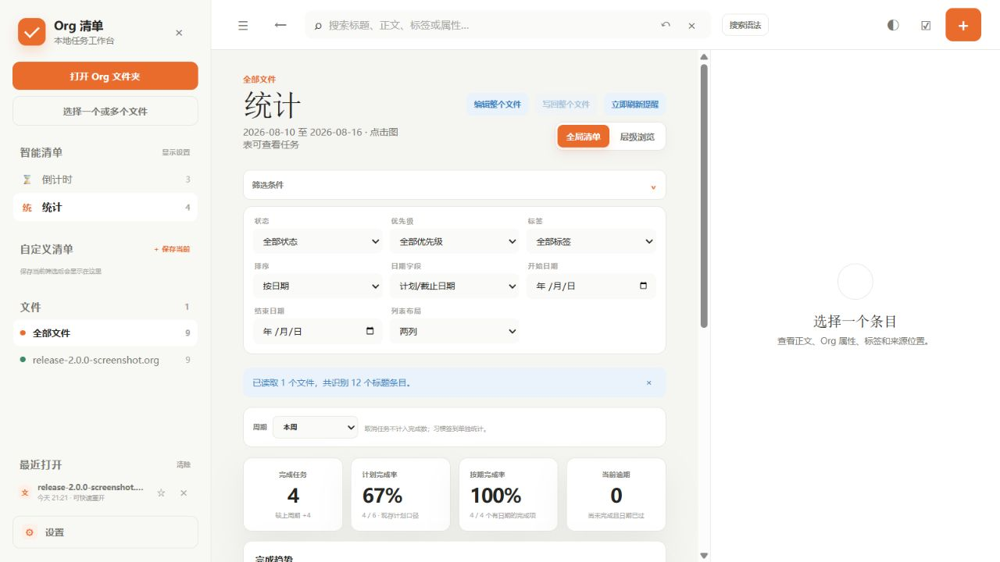
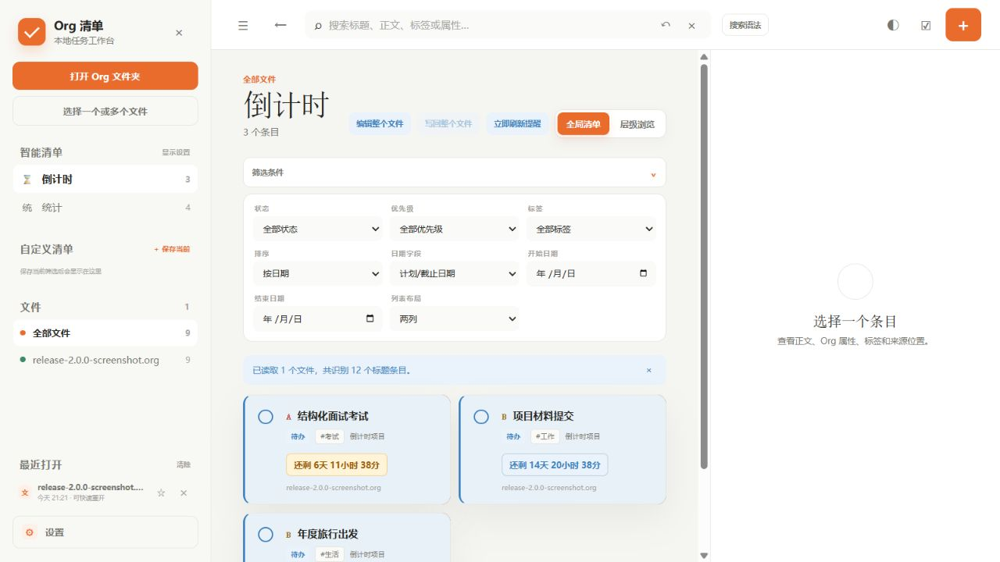
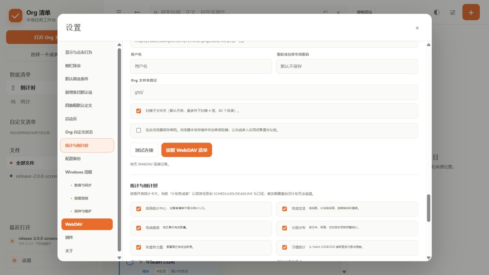

# Org 清单 Android 版

安装包：[`OrglistAndroid.apk`](OrglistAndroid.apk)
版本化安装包：[`OrglistAndroid-v2.2.1.apk`](OrglistAndroid-v2.2.1.apk)

当前安装包版本：`2.2.1`（versionCode 26）  
Android 工程源码：`2.2.1`  
最低系统：Android 8.0（API 26）  
安装包 SHA-256：

```text
75fd77da0e5a2817556b1c0e9cd76826e6b365aacf60586d4d47a890cc2e7395
```

以下“更新内容”是版本历史；实际使用方式以本文后面的“当前提醒规则”和“常见问题”为准。
## 2.2.1 更新内容

- 修复空白画布工作台“布局”入口在手机窄屏、恢复布局或重新显示导航容器后难以点击的问题；使用模式改为普通按钮点击，仅布局模式保留拖动手柄。
- “设置 → 插件”会为支持独立布局入口的工作台插件显示备用“布局”按钮，可直接进入布局模式。
- “关于”的当前版本更新为 2.2.1；Android 工程 `versionCode` 更新为 26。

## 2.2.0 更新内容

- 修复 APK 只能选择单个或多个文件、无法打开整个 Org 文件夹的问题。
- “打开 Org 文件夹”现在调用 Android 系统目录选择器，递归读取所选目录及子目录中的 `.org` 文件。
- 保留目录读写授权，支持编辑时重新读取磁盘最新内容，并将修改直接写回原 Org 文件。
- “关于”的当前版本更新为 2.2.0；Android 工程 `versionCode` 更新为 25。


## 2.1.0 更新内容

- 搜索框新增 AI 对话模式：支持把中文需求转换为搜索语法，也支持询问功能说明和操作方法。
- 默认使用 DeepSeek V4 Flash 预设；API Key、模型、接口、鉴权和兼容协议均可在设置中配置并测试。
- AI 转换出搜索条件后会立即执行并退出 AI 模式，回车后直接显示正常搜索结果。
- Android AI 请求改走原生 HTTPS 网络桥接，并开放桥接所需的 POST 请求，避免 WebView 跨域限制。
- “关于”的当前版本更新为 2.1.0；Android 工程 `versionCode` 更新为 24。

## 2.0.0 更新内容

### 统计中心与倒计时

- 智能清单新增“统计”，支持本周、本月和今年三个周期，显示完成数、计划完成率、按期完成率、当前逾期、完成趋势、分类分布、年度热力图和 Habit 签到。
- 每项统计都有独立开关；统计入口本身、默认周期、分类方式、倒计时临近阈值和紧凑列表也可以配置。
- 智能清单新增“倒计时”。任务可设置目标日期/时间、到期后的显示方式和置顶；任务卡片、详情、日历基础任务视图与可配置工作台都能显示剩余时间。
- 搜索语法新增 `has:countdown`、`countdown:today`、`countdown:next7d`、`countdown:next30d`、`countdown:overdue`、`countdown:pinned` 和日期范围，可保存为自定义清单或用于小窗口布局。
- “计划完成率”的当前口径为：统计周期内计划到期的任务中，已经完成的比例；使用任务现存的 `SCHEDULED` / `DEADLINE`，改期后被覆盖的旧计划不能追溯。







### 图片、搜索与编辑

- 图片预览完善：详情可内嵌显示，原文编辑和高级 Vim 使用独立预览区；图片支持定位链接、移除链接和撤销。
- 写回 Org 后只在完整扫描确认图片已无引用时，才询问移入自定义图片回收站；单独打开文件、扫描不完整、外链或目录外图片不会自动移动。
- 搜索新增文件限定：`file:inbox.org`、多个 `file:` 条件，以及明确表示全部文件的 `file:all` / `file:*`；不写 `file:` 仍默认搜索全部已加载文件。
- 批量“移为子项”和直接拖动同时保留，均支持跨文件移动多棵子树并自动调整 Org 标题层级。

### 插件、工作台与 Android

- 可配置工作台升级到 4.0.0：支持统计、倒计时、任务日历基础视图，兼容主清单展开后的“应用当前筛选”，并可为各节点单独设置框线、说明、标题栏、内容区与精细位置。
- 工作台在布局模式可定位并高亮节点；条目详情、折叠高度与多主清单能力恢复并统一兼容新视图。
- 高级 Vim、主题和格式扩展继续采用外部插件方式，Windows 与 Android 使用同一插件格式。
- Android 后台 WebDAV 提醒、定时通知、SCHEDULED/DEADLINE 独立闹钟与运行诊断继续保留；图片 WebDAV 读写和回收站移动由原生桥接支持。
- “关于”的当前版本更新为 2.0.0；Android 工程 `versionCode` 更新为 23。

## 1.8.0 更新内容

- 设置页新增外部插件导入、启用、停用和删除；插件代码保存在 Android WebView 自身的 IndexedDB。
- 插件宿主 API 2 支持外部编辑器插件、编辑格式插件，以及可控制整个页面样式的 `.css` / JavaScript 主题插件。
- 高级 Vim 改为独立导入文件，不再作为主程序固定目录项或 APK 内嵌资源。
- Windows 与 Android 使用同一插件格式；Android 插件不能使用 Windows 本地桥接或启动桌面应用。
- 支持 Org 标准图片链接，例如 `[[file:./mainImage/photo.png]]`；详情内嵌、描述链接悬停预览并可点击大图，原文编辑与 Vim 使用独立预览区。
- 支持 `#+CAPTION`、`#+ATTR_HTML` 的宽度/对齐，并可在显示设置中配置默认图片文件夹；WebDAV 图片由 Android 原生桥接按二进制安全读取。
- 布局插件 API 新增主程序公开设置注册表；空白画布工作台 3.22.0 可动态显示和修改默认图片文件夹等非敏感设置，密码与令牌不公开。

## 1.7.0 更新内容

- 新增轻量编辑器插件宿主；可按需加载随 APK 离线提供的“高级 Vim”，关闭插件后恢复内置轻量编辑器并保留正文。
- 高级 Vim 基于 CodeMirror Vim，支持数字前缀、operator + motion、文本对象、寄存器、marks、宏、点重复、搜索替换和 Ex 命令。
- Android 与 Windows 使用同一高级 Vim 插件资源；Android 不显示 Windows“用其他应用打开”，也没有启动桌面应用的桥接权限。
- “关于”的当前版本同步更新为 1.7.0；Android 工程 `versionCode` 更新为 21。

## 1.6.1 更新内容

- 批量模式同时支持两种“移为子项”操作：可以按住选中卡片左侧 `⋮⋮` 直接拖到目标条目，也可以点击批量栏的“移为子项”，依次选择目标文件和目标父项。
- 两种方式都能跨文件移动多棵子树，并自动调整整棵子树的 Org 标题层级；目标文件和来源文件都会标记为尚未写回。直接拖动支持鼠标与触摸屏。
- “关于”的当前版本同步更新为 1.6.1；Android 工程 `versionCode` 更新为 20。

## 1.6.0 更新内容

- 可视化新增/编辑支持 Org Habit：写入 `:STYLE: habit` 与 SCHEDULED 重复规则，完成一次后记录 `:LAST_REPEAT:`、`:LOGBOOK:` 并自动推进下次计划。
- 支持 `<%%(diary-chinese-anniversary 月 日)>` 农历周年；页面会映射为每年的公历日期，并显示在今天、未来和日历中。
- Windows 与 Android 后台扫描会把当天农历周年加入每日汇总通知；习惯续期后的新 SCHEDULED 会按现有通知与闹钟规则重新安排。
- 智能清单新增“习惯”；日历月、周、日视图显示农历日期与常见农历/公历节日，年视图列出每月主要节日。
- “关于”的当前版本同步更新为 1.6.0；Android `versionCode` 更新为 19。

## 1.4.9 更新内容

- 可视化编辑器在 SCHEDULED 和 DEADLINE 后分别提供“闹钟声音”勾选，可自由选择只让开始时间、截止时间或两个时间响铃。
- 新增 `:SCHEDULED_ALARM: true` 和 `:DEADLINE_ALARM: true` 条目属性，Windows 与 Android 后台提醒均按对应时间独立判断。
- 继续兼容旧的 `:ALARM: true`，读取时视为两个闹钟都启用；用新版编辑器保存后会转换为独立属性。
- “关于”的当前版本同步更新为 1.4.9。

## 1.4.8 更新内容

- 修复部分 Android XML 解析器不支持 `disallow-doctype-decl` 时 WebDAV 扫描整轮失败的问题；不支持的安全特性现在会兼容降级，其他可用的实体防护仍会启用。
- 修复 Windows 自定义 WAV 分支的 PowerShell 条件结构，并在播放前显式加载声音文件；路径不存在或读取失败时自动回退系统提示音。
- “关于”的当前版本同步更新为 1.4.8。

## 1.4.7 更新内容

- “立即同步”改名为“立即刷新 WebDAV 提醒”，并在 Windows WebDAV 提醒设置中提供同一功能。
- 定时 `SCHEDULED` / `DEADLINE` 条目保持独立通知，不再与同轮扫描到的其他项目混合。
- 修复旧 Windows 后台助手仍受已移除的闹钟总开关影响、导致条目闹钟不响的问题。
- 修复 Android 每轮同步都取消并重排相同闹钟、可能让近似提醒被不断推迟而永远不触发的问题。
- 修复 Android“编辑已提醒记录”只显示 `{}`；现在同时显示已提醒记录、待触发计划和最近同步诊断。
- Android 运行状态新增已安排提醒数量，便于区分“测试通知正常”和“实际项目是否已进入调度”。
- “关于”的当前版本已同步更新为 1.4.7。

## 1.4.6 更新内容

- 移除提醒设置中重复的“启用闹钟声音”总开关；条目勾选“闹钟声音”后即可在到点通知之外播放铃声。
- 修复 Android 12 及以上未授予精确闹钟权限时整轮提醒安排失败的问题；现在会自动降级为系统近似提醒。
- 修复带具体时间的 `SCHEDULED` 条目没有按开始时间发送通知或播放闹钟的问题。
- 无具体时间的任务才进入每日汇总，避免带时间条目同时收到汇总与单独提醒。

## 1.4.5 更新内容

- 测试闹钟声音时通知也带“停止闹钟”按钮，可直接关闭响铃。
- Android 检查间隔放开到 1–1440 分钟（原最短 15 分钟），方便测试；后台改为系统闹钟自调度，间隔设置会真正生效。
- Windows 闹钟窗口重新设计：暖色主题、更大更清晰的标题和停止按钮。

## 1.4.4 更新内容

- 闹钟开始支持条目级控制；当时仍保留全局“启用闹钟声音”总开关，该总开关已在 1.4.6 中取消。
- Android 闹钟改用系统闹钟调度（setAlarmClock），无需额外权限即可精确到点触发，且不受省电延迟影响，修复“到点不通知”。
- Android 闹钟响铃后会在通知中点“停止闹钟”关闭，60 秒后也会自动停止。
- Windows 闹钟弹出可关闭的“停止闹钟”窗口，点击即停止声音。
- 设置中“清除已提醒”“编辑已提醒记录”移到独立一行。

## 1.4.3 更新内容

- Android 新增闹钟提醒：到点播放系统闹钟铃声（可自选铃声），循环播放直到在通知中点“停止闹钟”。
- 修复后台同步在网络不稳定时不执行的问题：同步任务不再强制要求网络连接，失败会自动重试。
- 设置中新增“立即同步”按钮，可随时从 WebDAV 拉取并重新安排提醒。
- 支持直接编辑已提醒记录（Android 端以 JSON 形式编辑），Windows 与 Android 行为一致。
- 闹钟声音与通知可以分别开启/关闭；Windows 可设置重复次数、间隔和自定义 .wav。
- 同步 Windows 全部最新改动（新增条目默认项、清除已提醒记录等）。

## 1.4.2 更新内容

- 统一 Windows 与 Android 提醒设置中的两段说明文字样式，排列更整齐。

## 1.4.1 更新内容

- APK 设置目录会按平台显示“Android 提醒”，电脑端显示“Windows 提醒”。
- 日期和时间字段在 Windows 与 Android 上均支持键盘直接输入，也可点击右侧按钮打开系统选择器。
- “刷新状态”改为“刷新运行状态”，并补充其只读取后台状态、不修改数据的说明。

## 1.4.0 更新内容

- 新增 Android 系统级后台提醒，不打开 App 也能收到已同步任务的通知。
- 使用 WorkManager 定期从 HTTPS WebDAV 同步 Org 文件，最短间隔 15 分钟。
- 使用系统闹钟安排每日任务汇总和带具体时间的 DEADLINE 提醒。
- 支持多个每日提醒时间、错过后补发或跳过、同时提醒合并。
- 手机重启、App 更新、时间或时区变化后会自动恢复后台同步和闹钟。
- Android 12 及以上可进入系统页面允许精确提醒；未授权时自动使用近似时间提醒。
- Android 13 及以上会在启用时请求通知权限。

- 同步当前最新版 Org 清单页面及其全部设置、筛选、日历、批量操作和文件编辑功能。
- 全局清单与层级浏览使用更清晰的整张卡片状态配色。
- 完整文件编辑器支持行号、搜索、替换、Org 彩色高亮和基础 Vim 模式。
- Vim 模式支持光标跟随滚动、底部命令行、`:60` 行跳转及常用保存/替换命令。
- 原文和彩色高亮模式的输入区域都会自动铺满编辑器高度，避免底部出现无效空白。
- 编辑器“上一个/下一个”会滚动到实际匹配位置，并显示匹配序号与行号。

## 这个版本解决什么问题

Android 版把完整 Org 清单网页和 WebDAV 原生网络桥接放进同一个 App：

- 不需要电脑开机。
- 不需要运行 CMD 或 Python。
- 不要求手机和电脑处于同一 Wi-Fi。
- WebDAV 请求不经过手机浏览器的 CORS 限制。
- 未启用后台提醒时，只在打开 App 并读取或写入文件时联网；启用后会按设置周期在后台同步。
- Org 文件仍保存在你自己的 WebDAV 服务中。

## 安装

1. 把 `OrglistAndroid.apk` 发送或复制到手机。
2. 在手机文件管理器中点击 APK。
3. 如果系统阻止安装，按照提示允许当前文件管理器“安装未知应用”。
4. 完成安装后，在桌面打开“Org 清单”。

这是个人测试签名安装包，不是应用商店版本。Android 因为安装来源不明而显示风险提示是正常现象；请只使用本目录中交付的 APK。

## 配置 WebDAV

1. 打开 App。
2. 点击右上角“设置”。
3. 在 WebDAV 区域确认显示“Android 原生 WebDAV 已启用”。
4. 填写服务器地址、用户名、应用专用密码。
5. 如果 Org 文件不在 WebDAV 根目录，填写“Org 文件夹路径”，例如 `gtd/`。
6. 点击“测试连接”。
7. 成功后点击“读取 WebDAV 清单”。

## 配置 Android 系统提醒

1. 在 WebDAV 设置中勾选“保存密码”，保存可正常连接的 WebDAV 记录。
2. 重新进入“设置 → Android 系统提醒”。
3. 启用 Android 后台提醒，并选择刚才保存的 WebDAV 连接。
4. 后台同步间隔最短为 1 分钟，可设置每日汇总时间，以及 SCHEDULED、DEADLINE 各自的提前提醒分钟数。
5. 保存后允许系统通知权限。
6. 点击“允许精确提醒”，在 Android 系统页面允许 Orglist 设置闹钟和提醒。
7. 返回设置页刷新状态，可查看最近同步、扫描条目数和下次提醒时间。
8. 需要立刻读取 WebDAV 最新内容时，点击“立即刷新提醒”；同步完成后会自动显示最新运行状态。

精确权限未授予时不会完全失效，而是降级为近似时间提醒；授予后更容易准点触发。省电模式、无网络或部分手机厂商的后台限制仍可能推迟 WebDAV 同步；已经同步并交给系统闹钟的任务不需要在触发时重新联网。

## 当前提醒规则

- 所有符合条件的任务都会发送 Android 系统通知。
- 只有勾选对应的“SCHEDULED 闹钟声音”或“DEADLINE 闹钟声音”时，才在该类通知之外播放闹钟；两项互不影响。
- 默认新属性分别为 `:SCHEDULED_ALARM: true` 和 `:DEADLINE_ALARM: true`；旧的 `:ALARM: true` 兼容为两项都启用。`1.5.0` 源码可在“提醒规则”中分别自定义这三个属性名。
- 带具体时间的 `SCHEDULED` 按“SCHEDULED 提前提醒分钟数”单独提醒，默认提前 0 分钟。
- 带具体时间的 `DEADLINE` 按“DEADLINE 提前提醒分钟数”单独提醒。
- 没有具体时间的 `SCHEDULED` / `DEADLINE` 进入每日汇总。
- `<%%(diary-chinese-anniversary 月 日)>` 农历周年会先换算为当年的公历日期，并在当天进入每日汇总；普通月份与闰月分开判断。
- `:STYLE: habit` 习惯在页面中完成一次后会自动推进新的 `SCHEDULED`；后台下次刷新时按新时间重新安排通知。重复规则支持 `.+1d`、`++1w`、`++1m` 等 Org Habit 写法。
- 定时 `SCHEDULED` / `DEADLINE` 保持独立通知，不与同轮其他项目合并。
- 每次后台同步只新增、更新或移除真正变化的计划，不会反复取消并重排相同闹钟。

读取完成后，搜索、层级浏览、四象限、日历、新增、编辑和删除功能与电脑本地版一致。

### 坚果云示例

```text
服务器地址：https://dav.jianguoyun.com/dav/
用户名：坚果云账号邮箱
密码：坚果云第三方应用密码
Org 文件夹路径：gtd/
```

请在坚果云的“账户信息 → 安全选项 → 第三方应用管理”中生成单独的应用密码，不要填写主账号登录密码。

### Nextcloud 示例

```text
服务器地址：https://你的服务器/remote.php/dav/files/用户名/
用户名：Nextcloud 用户名
密码：Nextcloud 应用密码
Org 文件夹路径：gtd/
```

## 写回文件

编辑后必须选择：

- “写回原文件”：直接更新 WebDAV 上的 Org 文件。
- “下载修改后的文件”：在手机生成一个副本。
- “应用到当前页面”：只修改 App 当前内存，退出或刷新后会丢失。

写回前会使用 WebDAV ETag 检查远端版本。如果其他设备已经修改同一个文件，App 会阻止直接覆盖。

## 安全设置

- Android 版只允许连接 `https://` WebDAV，避免账号密码通过明文网络传输。
- 外部网页链接会交给系统浏览器打开，不会在具有 WebDAV 权限的内置页面中打开。
- 密码默认不保存。
- 启用后台提醒时，所选 WebDAV 密码会复制到 Android 原生私有配置，并使用 Android Keystore 密钥加密。
- APK 不包含你的 Org 文件、WebDAV 地址、用户名或密码。

## 常见问题

### 安装时提示无法安装

- 确认 Android 版本为 8.0 或更高。
- 允许当前文件管理器安装未知应用。
- 如果之前安装过不同签名的同名测试版，需要先卸载旧版。卸载会清除 App 中保存的设置。

### 设置中没有显示“Android 原生 WebDAV 已启用”

确认打开的是安装后的“Org 清单”App，而不是手机浏览器中的 HTML 文件。

### HTTP WebDAV 无法连接

Android 版只允许 HTTPS。请为 WebDAV 服务配置有效 HTTPS，或改用提供 HTTPS 的坚果云、Nextcloud 等服务。

### 连接成功但没有 Org 文件

- 检查文件扩展名是否为 `.org`。
- 检查“Org 文件夹路径”。
- 开启扫描子文件夹。
- 先把至少一个 `.org` 文件上传到目标目录。

### App 关闭后是否还能提醒

可以。启用 Android 后台提醒后，WorkManager 会周期同步 WebDAV，系统闹钟负责触发已经读取到的提醒。强行停止 App 会让 Android 暂停其后台任务，需要重新打开 App 才会恢复。

### 测试通知和测试闹钟正常，但实际任务不提醒

测试按钮会绕过 WebDAV 扫描和系统调度，因此只能证明权限或声音播放正常。请点击“立即刷新提醒”，等待页面自动显示运行状态并检查：

- “扫描到”应大于 0，否则查看最近检查错误。
- “已安排提醒数量”应与当前符合条件的未来任务相符。
- “下次提醒”应显示合理的未来时间。
- 通知权限应显示已允许；精确提醒权限未允许时可能出现延迟。

还可以打开“编辑已提醒记录”查看 JSON：

```json
{
  "sent": {},
  "pending": [],
  "lastSync": "",
  "lastError": "",
  "lastTaskCount": 0,
  "nextAlarmAt": 0
}
```

字段含义：

- `sent`：已经触发过的提醒。
- `pending`：已安排、尚未触发的系统计划。
- `lastSync`：最近一次后台扫描时间。
- `lastError`：最近 WebDAV 扫描或解析错误；非空时应优先处理该错误。
- `lastTaskCount`：扫描到的 Org 条目数量。
- `nextAlarmAt`：下次触发时间；`0` 表示当前没有待触发计划。

如果 `lastTaskCount` 为 0、`pending` 为空且 `lastError` 非空，说明失败发生在扫描或解析阶段，不是通知权限问题。
