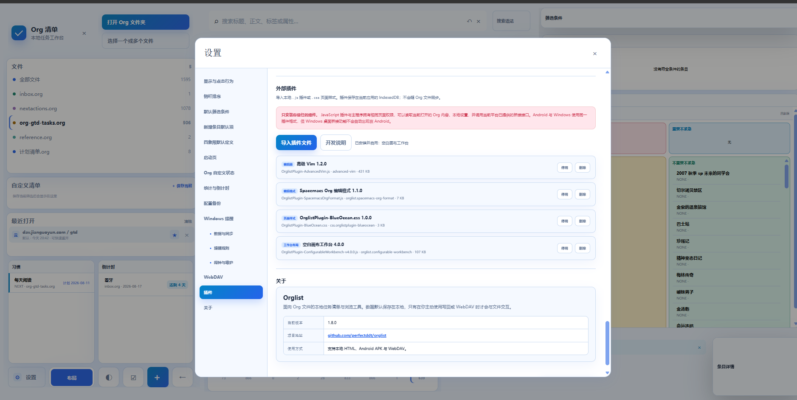
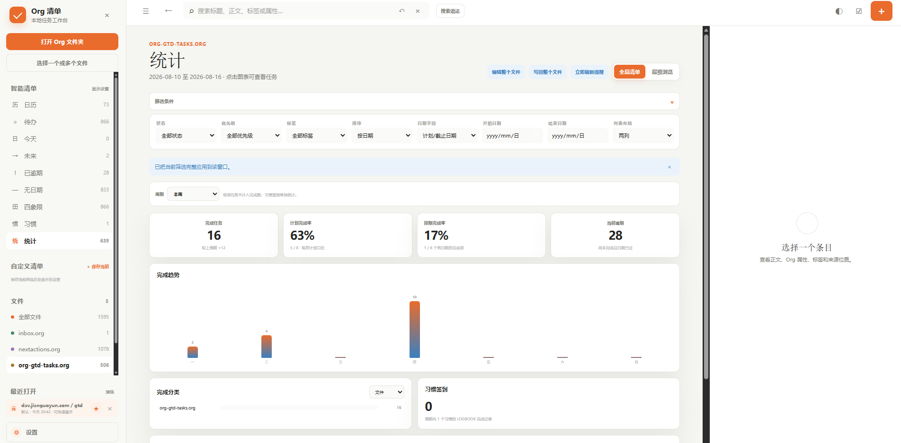
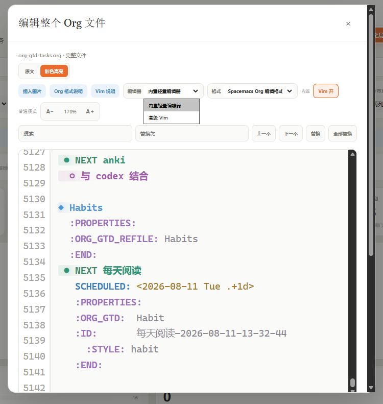
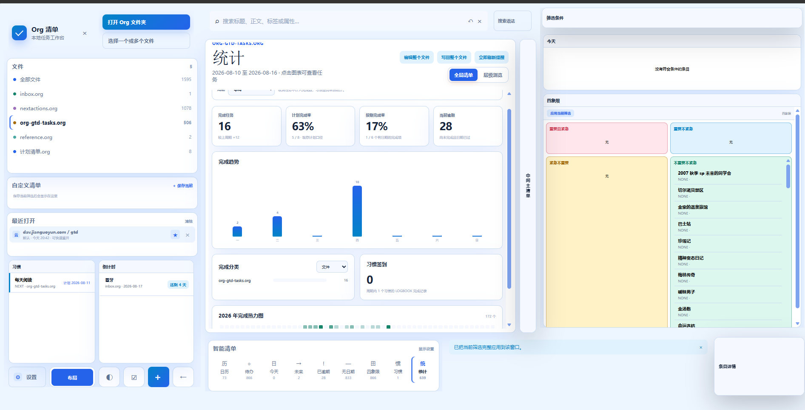

# Org 清单本地工作台使用说明

主程序：[`Orglist.html`](Orglist.html)

供 AI 检索、提示词接入和功能问答使用的结构化说明：[`README-AI.md`](README-AI.md)。

这是一个读取和管理 Org Mode 计划清单的单文件网页。默认完全在本地运行，不需要登录账号，也不会主动上传 Org 文件。

Android 手机可直接安装 [`OrglistAndroid.apk`](OrglistAndroid.apk)，详细步骤见
[`README-Android.md`](README-Android.md)。

Windows HTML、Android 工程源码与当前安装包均为 `2.2.1`（versionCode 26）。

## 2.2.1 功能概览

- 修复空白画布工作台“布局”入口在手机窄屏、恢复布局或重新显示导航容器后难以点击的问题；使用模式改为普通按钮点击，仅布局模式保留拖动手柄。
- “设置 → 插件”会为支持独立布局入口的工作台插件显示备用“布局”按钮，可直接进入布局模式。
- 手机预览固定使用 8765 端口，避免不同启动端口对应不同的 IndexedDB 插件库。

## 2.2.0 功能概览

- Android 版“打开 Org 文件夹”改用系统目录授权，可选择整个文件夹并递归读取其中的 `.org` 文件。
- Android 会保留系统授予的目录读写权限；通过目录打开的 Org 文件可在编辑后直接写回原文件。
- 保留“选择一个或多个文件”的原有用法，可按需选择单文件、多文件或整个目录。

## 2.1.0 功能概览

- 搜索框新增 AI 对话模式，可将中文需求转换成 Orglist 搜索语法，也可解释软件功能和操作方法。
- 默认提供 DeepSeek V4 Flash 预设，可在设置中填写 API Key、模型、接口地址、鉴权方式和兼容协议，并测试连接。
- AI 生成搜索条件后会直接应用并退出 AI 模式，回车即可回到普通搜索结果，无需再次点击 AI 按钮。
- Windows 本地桥接与 Android 原生网络桥接均可转发 AI 请求，避免浏览器或 WebView 跨域限制。

## 2.0.0 功能概览

- 新增可按周、月、年查看的统计中心，完成数、计划完成率、按期完成、逾期、趋势、分类、年度热力图与习惯统计均可单独开关。
- 新增任务倒计时、倒计时智能清单与搜索语法；列表、详情、日历基础任务视图和可配置工作台均可显示剩余时间。
- 按文件搜索支持 `file:文件名`、`file:all` 和 `file:*`；不写 `file:` 时仍搜索全部文件。
- 图片支持详情/编辑/Vim 预览、定位与移除链接，以及完整引用检查后的安全回收站移动。
- 可配置工作台 4.0.0 兼容统计、倒计时、当前筛选、任务日历和条目详情，并完善节点外观与精细布局。

### Windows 界面预览

以下截图依次展示 Windows 本地版的插件管理、统计中心、Org 文件编辑和自定义工作台布局。

#### 1. 插件界面

可导入、启用、停用和删除高级 Vim、Org 编辑格式、主题及空白画布工作台等外部插件。



#### 2. 统计界面

按周期查看完成任务、计划完成率、按期完成率、当前逾期、完成趋势、完成分类和习惯签到。



#### 3. 编辑界面

整个 Org 文件支持原文和彩色高亮编辑，可在内置轻量编辑器与高级 Vim 之间切换，并提供搜索替换、图片插入和格式选择。



#### 4. 自定义布局

空白画布工作台可组合统计、智能清单、倒计时、四象限、筛选区和条目详情，并为不同使用场景保存布局。



Android 版的统计中心、倒计时清单和功能开关截图见 [`README-Android.md`](README-Android.md#200-更新内容)。

## 1. 快速开始

1. 双击打开 `Orglist.html`。
2. 点击左侧“打开 Org 文件夹”。
3. 选择存放 `.org` 文件的文件夹，并允许浏览器读取文件。
4. 如果浏览器不支持选择文件夹，可使用“选择一个或多个文件”。

推荐使用最新版 Chrome 或 Edge。使用“打开 Org 文件夹”并授予读写权限后，编辑结果可以直接写回原文件；使用普通文件选择器时，浏览器可能只允许下载修改后的副本。

## 2. 页面结构

- 左侧：智能清单、自定义清单、文件列表和最近打开记录。
- 中间：搜索、筛选、任务清单、层级浏览、四象限及日历。
- 右侧：当前条目详情、可视化编辑和原文编辑入口。
- 手机窄屏：点击菜单按钮打开左侧栏；条目详情默认不会在每次切换时自动弹出。搜索框与“搜索语法”分行显示，避免清除按钮遮挡。
- 手机条目左滑显示“编辑、日期、删除”，右滑进入批量选择；电脑端按住条目左右拖动也可使用相同行为。
- 顶部左箭头可按点击路径返回上一页，支持清单、文件、层级和条目详情；键盘也可使用 `Alt + ←`。
- “设置与 WebDAV”入口位于左侧栏底部。
- 顶部橙色 `＋` 用于新增条目，`☑` 用于主动进入批量选择。

智能清单、自定义清单、文件分组及其子项均可拖动排序。智能清单右侧的“显示设置”可以选择要显示的类别。

智能清单中的“习惯”会集中显示带 `:STYLE: habit` 的条目；它可在“显示设置”中隐藏或恢复，也能像其他智能清单一样调整导航顺序。

## 3. 清单与视图

### 全局清单

把不同文件和不同层级的任务集中展示。可以切换一列或两列。

### 层级浏览

按照 H1 → H2 → H3 的 Org 标题层级逐级进入，也可使用与全局清单相同的状态、优先级、标签和日期筛选。

### 四象限

显示：

- 重要且紧急
- 重要不紧急
- 不重要但紧急
- 不重要不紧急

“重要”和“紧急”的默认判断方式可在设置中保存；进入四象限后，也可以在筛选栏中临时调整。手机端仍保持 2×2 田字布局。

### 日历

支持年、月、周、日视图。月历日期右上角的数字表示按“当天任务定义”归入该日期的任务数量。

全局清单、层级浏览以及日历中的任务会按 Org 状态显示不同颜色；全局与层级条目会为整张卡片增加浅色底色，而不是只显示左侧色条。自定义状态会稳定映射到额外颜色，方便快速区分。

“当天任务定义”可以选择：

- 计划或截止日期
- 主日期
- 仅 DEADLINE
- 仅 SCHEDULED
- 所有日期（包括 CLOSED 等）

日视图按时间线显示；没有具体时间或位于时间范围之外的任务会进入“全天／区间外”。

月、周、日视图会同时显示农历月日，并标注春节、元宵、端午、中秋、重阳、除夕等农历节日，以及元旦、劳动节、国庆节等常见公历节日。年视图会在每个月卡片中列出该月的主要节日。

### 状态

默认状态为：

- `TODO`
- `NEXT`
- `DONE`
- `CNCL`：已取消，并按已完成处理

设置中的“Org 自定义状态”可以分别添加自定义未完成状态和已完成状态。`DONE`、`CNCL`、这里配置的自定义完成状态，以及带有 `CLOSED` 完成时间的条目都会显示灰色删除线。

可视化编辑或批量编辑把状态改为 `DONE`、`CNCL` 或自定义完成状态时，会在标题下一行自动添加当前 `CLOSED` 日期和时间。点击条目前的圆圈也会真正把 Org 状态改为 `DONE` 并添加 `CLOSED`；再次点击会改回 `TODO` 并移除 `CLOSED`。这些修改先保留在当前页面，需要再点击“写回已修改文件”。

`CANCELLED`、`CANCELED`、`STARTED`、`WAITING`、`HOLD`、`PROJECT` 不再作为内置状态识别；如确实需要其中某个名称，可以在设置中重新添加为自定义状态。

## 4. 搜索与筛选

普通文字用空格连接时表示 AND：

```text
报名 教师
```

常用语法：

```text
"结构化 面试"                         完整短语
TODO | NEXT                           OR
报名 -宁波                            排除词
/教师|事业单位/i                      正则表达式
grep:/CLOSED:.*2026-07/i              对完整条目执行正则
title:考试 tag:工作                   标题和标签
file:org-gtd-tasks.org                按文件名筛选
file:inbox.org,nextactions.org        限定在多个文件中搜索（逗号分隔）
file:all                              搜索所有文件（不写 file: 即默认所有文件）
status:TODO priority:A                状态和优先级
prop:ORG_GTD=Calendar                 Org 属性
level:1..3                            标题层级
deadline:2026-07-01..2026-07-31       日期闭区间
scheduled:<2026-08-01                 日期比较
closed:today                          today/yesterday/tomorrow
has:deadline overdue:true             是否有截止日期、是否逾期
```

正则支持 `i`、`m`、`s`、`u` 标志。点击搜索框旁的“搜索语法”可随时查看内置说明。搜索历史只保留适量记录，并存储在当前浏览器。

### AI 搜索与功能问答

1. 打开“设置 → AI 助手”，勾选启用。
2. 默认预设已经填写 `https://api.deepseek.com/chat/completions`、Chat Completions 协议和 `deepseek-v4-flash`，通常只需填写 API Key、勾选启用，再点击“测试 AI 连接”。如需其他服务商，可选择“自定义兼容接口”。
3. 点击顶部搜索框内的“AI”，输入自然语言并按 Enter。

AI 可以把“找出今天未完成的任务”转换成页面支持的搜索表达式，也可以解释批量操作、写回、WebDAV 等功能。搜索表达式应用前会在本地校验；转换成功后会自动关闭 AI 面板、切回普通搜索界面并直接显示结果，不需要再次点击 AI。打开清单或设置等操作会显示为可点击建议。AI 不会直接写回、删除、完成或编辑 Org 条目。

默认只向服务商发送对话、当前日期，以及可选的文件名/标签/状态/筛选摘要，不发送任务标题、正文或 Org 原文。API Key 默认只保存在当前标签页会话；勾选“关闭浏览器后仍在本机保存”后才会写入浏览器本地存储。配置备份不包含 API Key，并会清空额外请求头。

如果浏览器提示 CORS 或无法直连，可改用 `OrglistWebDAV.cmd` 自动打开的页面，让请求经本机桥接转发。完整的 AI 可读搜索、操作和安全说明见 [`README-AI.md`](README-AI.md)。

## 5. 新增条目

点击顶部橙色 `＋`。

### 单条新增

选择目标文件、添加位置、标题、状态、优先级、标签、计划日期、截止日期及正文。

添加位置支持：

- 父级内容末尾
- 父级内容开头
- 指定条目之前
- 指定条目及其所有子项之后

### 批量新增

切换到“批量新增”，每行输入一个项目。系统会实时预览识别结果，一次最多新增 300 条。

示例：

```text
准备报名材料 明天 09:00 #工作
提交资格复审 截止 2026-08-05 18:00 #报名 [#A]
NEXT 联系面试单位 下周一 #面试
- [x] 整理旧材料 7/30 #归档
```

可以识别：

- `TODO`、`NEXT`、`DONE`、中文状态和 `[ ]`、`[x]` 复选框
- `[#A]` 等优先级
- `#工作` 和 Org 尾部标签
- 今天、明天、后天、下周一、7月30日、`2026-08-05`
- `09:00`、上午9点、下午3点半
- 计划、安排、截止、到期、完成于

还可为所有批量条目设置默认状态、默认优先级和公共标签。

## 6. 编辑、删除与保存

### 可视化编辑

在条目详情中点击“可视化编辑”，可修改常用字段，不需要手写 Org 语法。

#### 习惯（Org Habit）

勾选“习惯（Org Habit）”后，需要同时填写 SCHEDULED 日期和重复规则。保存时会写入 `:STYLE: habit`，并把重复规则放进 SCHEDULED 时间戳：

```org
* NEXT 每天阅读
SCHEDULED: <2026-08-11 Tue .+1d>
:PROPERTIES:
:STYLE: habit
:END:
```

- `.+1d`：从实际完成日期起再推 1 天，适合只关心两次完成之间间隔的习惯。
- `++1w`：保持固定的每周节奏；即使晚完成，也会推进到下一个尚未到达的周期。
- `+1w`：只从原 SCHEDULED 顺延一次，延迟较久时可能留下已经逾期的下一次。
- 支持 `d`（天）、`w`（周）、`m`（月）、`y`（年），也兼容 `.+2d/4d` 这类 Org 习惯范围写法。

点击习惯前的完成圆圈时，Orglist 不会把标题永久改成 DONE。它会写入 `:LAST_REPEAT:` 与 `:LOGBOOK:` 完成历史，保留原来的 TODO/NEXT 状态，并自动更新到下一次 SCHEDULED。修改先保留在页面中，仍需写回文件。

#### 农历周年

勾选“农历周年”并填写农历月、日后，会保存为 Emacs Org diary 表达式：

```org
* NEXT 妈妈农历生日
<%%(diary-chinese-anniversary 8 15)>
```

月、日均为农历数值。农历周年不是 Habit，不会写入 `:STYLE: habit`。Orglist 会计算下一次对应的公历日期，让它进入“今天”“未来”和日历；Windows 与 Android 后台提醒也会把当天的农历周年放进无具体时间任务的每日汇总通知。闰月不会误当成普通月份周年。

### 编辑原文

点击“编辑原文”可在以下两种模式间切换：

- 原文
- Org 彩色高亮

两种模式都支持整体字体放大、缩小、行号、搜索、上一个/下一个、单次替换和全部替换。点击“Org 格式说明”可以查看标题、状态、日期、属性、链接、列表和强调格式。

Org 图片使用标准链接，例如 `[[file:./mainImage/photo.png]]`。打开本地文件夹时会同时取得目录内图片的读写权限；WebDAV 来源按当前 Org 文件地址读写相对图片。原文编辑器和可视化编辑器都提供“插入图片”：选择图片后会保存到“设置 → 显示”中的默认图片文件夹（例如 `mainImage`），并在光标处插入标准 Org 链接；遇到同名文件自动追加序号，不覆盖原图。图片文件选择后立即保存，正文链接仍需点击“应用”或“写回”才会写入 Org 文件。单独打开的 `.org` 文件没有相邻目录写入权限，需要改用“打开 Org 文件夹”；WebDAV 来源可直接上传。条目详情中，无描述的图片直接内嵌，带描述的链接鼠标划过时预览，点击可看大图；原文编辑、内置 Vim 和高级 Vim 始终保持纯文本，图片显示在独立预览区，避免影响光标、行号和撤销。支持 `#+CAPTION`，以及 `#+ATTR_HTML: :width 320px :align center`。只写 `[[file:photo.png]]` 时才用默认图片文件夹补全；明确写出的相对路径始终优先。

编辑器的每张预览图提供“定位链接”和“移除链接”。移除只修改当前编辑文本，并可通过普通撤销或 Vim `u` 恢复；独占一行的图片会同时移除紧邻的 `#+CAPTION`、`#+ATTR_HTML`。图片文件不会在编辑时立即删除。Org 成功写回后，只有在完整打开并扫描整个本地或 WebDAV Org 文件夹、确认所有已加载 Org 文件都不再引用、且图片位于默认图片文件夹内时，才询问是否移入图片回收站。“设置 → 显示 → 图片回收站文件夹”可自定义相对路径；留空时使用“默认图片文件夹/.orglist-trash”。单独打开文件、扫描不完整、外链、绝对路径、附件和图片目录之外的文件不会自动处理。

“Vim 开关”提供最基本的普通/插入模式：`i`、`a`、`h/j/k/l`、`0`、`$`、`w`、`b`、`x`、`dd`、`gg`、`G`、`o/O` 和 `/` 搜索。按 `v` 进入字符选择模式，再用移动键扩展选择；`d/x` 删除选择，`c` 删除后进入插入模式，`v` 或 `Esc` 退出。连续使用 `j/k` 时编辑区会自动滚动，让光标始终保持可见。手机软键盘也会把这些英文按键解释为 Vim 命令；可点击“Esc／普通模式”返回普通模式。

普通模式按 `:` 可在编辑器底部调出命令行，支持 `:60` 跳到第 60 行，以及 `:w`、`:wq`、`:q`、`:q!`、`:%s/旧/新/g`、`:set number`、`:set nonumber` 和 `:help`。为保证正文和行号严格对齐，编辑器不会自动折行；长行使用底部横向滚动条查看。编辑器上方的“Vim 说明”也会显示完整速查。它是轻量辅助，不等同于完整 Vim。

插件不再内置在主程序目录中。打开“设置 → 插件”可导入可信的 `.js` 功能插件或 `.css` 页面样式，安装内容和启用状态保存在本机 IndexedDB。宿主支持编辑器、编辑格式、全页样式和工作台布局四类插件；完整 API 与安全说明见 [`README-Plugins.md`](README-Plugins.md)。

离线高级 Vim 现在是独立可导入文件 [`plugins/OrglistPlugin-AdvancedVim.js`](plugins/OrglistPlugin-AdvancedVim.js)。它基于 CodeMirror Vim，支持数字前缀、operator + motion、文本对象、寄存器、marks、宏、`.` 重复、更完整的搜索替换与 Ex 命令；只有用户导入、启用并在编辑器中选择后才运行。

[`plugins/OrglistPlugin-SpacemacsOrgFormat.js`](plugins/OrglistPlugin-SpacemacsOrgFormat.js) 提供 Spacemacs 风格的 Org 编辑显示：层级缩进、八级标题符号、分层配色，以及跟随最近标题层级的正文缩进。1.1.0 同时支持内置轻量编辑器与高级 Vim 1.2.0。导入并启用后，需要在编辑器工具栏的“格式”中选择；它只改变呈现层，不改写 Org 原文。

[`plugins/OrglistPlugin-BlueOcean.css`](plugins/OrglistPlugin-BlueOcean.css) 是可直接导入的蓝色页面主题，覆盖浅色和深色模式的主色、背景、侧栏、面板、按钮及焦点效果，不修改应用布局和 Org 数据。

[`plugins/OrglistPlugin-ConfigurableWorkbench.js`](plugins/OrglistPlugin-ConfigurableWorkbench.js) 4.1.14 是可导入的空白画布工作台。使用模式下的“布局”入口现在与其他按钮完全一致，只响应普通 `click`，不再参与按下、拖动或点击去重；“⋮⋮”拖动手柄仅在布局模式显示。主程序“设置 → 插件”还会在该插件旁显示备用“布局”按钮，可绕过画布入口直接打开布局面板。手机预览使用固定 8765 端口，避免每次启动因 origin 改变而加载不同的 IndexedDB 插件库。“布局”节点即使保存得很小也会保留至少 64×48px 的触控区域，按钮本身至少 52×40px；需要移动时使用独立“⋮⋮”手柄，不再从按钮或周围空白启动拖动。布局面板的每个普通节点后新增“隐藏”复选框，勾选立即隐藏、取消立即显示并持久保存；布局入口不允许快捷隐藏。窗口与容器新增 0–50 层级设置，数值越大越靠上，并提供置底、下移一层、上移一层、置顶快捷按钮；层级会随布局持久保存。修复按钮重新显示容器后，文件列表等子窗口仍被内容层隐藏的问题；容器现在始终显示其可见子节点。手机端的布局模式与使用模式共用同一套节点坐标、位置和宽高，切换模式不再自动堆叠、跳位或改变浮窗尺寸；窄屏布局模式仍可直接触摸拖动和缩放。窗口与容器都有独立的“使用模式显示节点”属性；按钮可绑定任意窗口或容器，点击一次隐藏、再点一次显示，状态持久保存。按钮可选择直角/圆角/胶囊/圆形，主题/蓝/绿/红/黄/中性/自定义颜色，实心/柔和/描边/无底色，以及字号、文字颜色和阴影。布局面板还包含动态的“主程序公开设置”，可在插件内修改默认图片文件夹、显示方式、默认筛选和四象限规则；宿主以后新增公开配置时，插件会按注册表自动生成控件，不必为每个设置再次修改插件。它分为“布局模式”和“使用模式”，两种模式共用同一套 12 列坐标，布局所见即使用所得；布局模式不再常驻显示节点标题，鼠标划过节点会弹出注释（仅布局模式显示），从节点任意处即可拖动，拖动/缩放默认按半格微调、按住 Shift 吸附整格，双击节点打开编辑表单，并可逐节点选择使用模式是否保留框线、是否显示内容。名称旁新增“显示标题”开关；节点头部右侧的灰色“窗口内容”类别文字已彻底去掉。装饰文字节点输入自定义文字后自动用作节点标题；文字大小、加粗和文字颜色只在“装饰文字/图案”节点出现，内容缩放对所有窗口可用。中间主清单可以通过表单添加多个：第一个沿用原主清单区域，其余是独立主清单窗口，每个都带“应用当前筛选”按钮，可把当前状态、优先级、标签、搜索语法、当前文件、智能清单视图（含四象限与月/周/日等日历）、自定义清单查询等全部条件分别保存到各窗口，应用后列表真正按这些条件过滤显示（含正确识别“未完成/OPEN”状态，不会再整列表清空）；“未完成”的定义可在筛选条件里自定义；主清单的基础视图双向跟随应用当前视图；任务/日历窗口自己设好的基础视图（如四象限）不会被应用筛选覆盖。布局按钮加大、更容易点击，并且它的“浮动”开关能真正持久保存——关闭浮动后重新打开仍保持停靠，不会再变回浮动。在“设置 → 插件”里删除插件时，该插件保存的布局、历史等设置会一并清除。点击任务/条目时，折叠的“条目详情”窗口会自动展开（任务窗口、四象限、第一个主清单都生效）。任务窗口的四象限视图在某个象限没有条目时，空栏高度自动收缩，不再强占一半。可折叠浮窗把“折叠前/折叠后”视为两个窗口：展开与折叠各自有独立的位置和大小，折叠宽高最小可到 0.1，且折叠高度拖动上限与加载一致（最多 15 行，重开不再变小）；折叠状态下隐藏原本内容，可设置“折叠显示文字”并选择横放或竖放；布局模式冻结使用模式的折叠状态，展开/折叠切换只在使用模式发生，表单可勾选“当前处于折叠状态”。任务窗口新增“四象限”视图：仅当基础视图选“四象限”时出现“重要判定/紧急判定”两个自定义规则，逐窗口保存；四象限沿用主清单的红/蓝/黄/绿配色，任务行带状态色和优先级标记，日历条目按状态着色。点击面板中的节点行或“定位”按钮会在整个画布中高亮并滚动到该节点。新增“按钮节点”、“装饰文字/图案”窗口（文字、横线、竖线、圆点、空白），智能清单窗口可设置一列列横排（图标在上、文字在下）。布局面板本身可按住标题栏拖动位置并记住；面板顶部的“默认布局与历史”按钮展开“设为默认布局”和自动记录的“布局历史”，可恢复、清空、导出为 JSON，也可导入 JSON 备份恢复。未勾选框线/内容的节点在使用模式隐藏边框和内容。条目详情窗口保持可见，未选中条目时显示“选择一个条目”空状态，点击任务后显示正文、Org 属性、标签和来源。首次安装采用接近原页面的侧栏、顶栏和中间清单排布。任务窗口支持普通筛选、四象限及年、月、周、日历视图；手机窄屏与桌面端一样按保存的节点坐标和尺寸显示，布局模式所见即使用模式所得。

### 编辑整个文件

先在左侧选择一个具体文件，再点击清单标题旁的“编辑整个文件”。编辑器会载入该文件的全部标题、正文和属性；可选择“应用整个文件”“写回整个文件”或“下载修改后的文件”。标题旁也提供独立的“写回整个文件”和“立即刷新提醒”按钮；后者不会打开设置窗口，会按当前来源直接重新扫描，并在主界面提示刷新结果。

Windows 版在完整文件编辑器中还提供“用其他应用打开”。浏览器不能把真实文件路径交给桌面程序，因此此功能仅在通过 `OrglistWebDAV.cmd` 打开的本机页面中可用：桥接服务创建 UTF-8 临时副本并显示 Windows“打开方式”选择器，外部修改会同步回 Orglist 编辑器，最后仍由“应用整个文件”或“写回整个文件”确认。Android 会隐藏此按钮，也不会暴露启动外部 Windows 应用的接口。

### 删除

点击条目详情中的“删除条目”。删除一个标题时，会同时删除它下面完整的子标题树，页面会在执行前显示删除范围。

### 移动

条目详情和左滑操作中提供“移动”。可以把当前标题连同完整子标题树移动到同一文件或其他文件，并选择父级开头、父级末尾、指定条目前或指定条目后；移动时会自动调整所有标题的星号层级。操作会先标记涉及文件为未写回，再由“写回已修改文件”统一保存。

### 批量选择与操作

- 点击顶部 `☑` 后，可逐项点击选择。
- 手机或电脑端向右滑动/拖动条目也会选择或取消选择。
- “移为子项”有两种入口：选中条目后，可按住卡片左侧 `⋮⋮` 拖动柄并拖到另一个条目上；也可点击批量栏的“移为子项”，依次选择目标文件和目标父项。两种方式都支持跨文件移动多棵完整子树并自动调整星号层级；同时选中父项与它的子项时只移动父项一次。直接拖动支持鼠标和触摸屏。
- 批量栏支持状态、优先级、标签追加/替换/移除、SCHEDULED/DEADLINE/CLOSED 日期、删除，以及将所有受影响的可写文件写回原文件。
- 批量删除也会包含所选标题下面的完整子标题树，并在写回前再次确认。

### 三种保存结果

- “应用到当前页面”：只修改当前页面内存，刷新页面后会丢失。
- 单条编辑中的“只写回当前条目”：先重新读取磁盘或 WebDAV 最新文件，只定位并合并当前条目；页面里其他未写回修改不会被提交。
- “写回整个文件”：提交当前页面内该文件的全部内容，会覆盖磁盘文件或 WebDAV 远程文件。
- “下载修改后的文件”：生成一个修改后的 `.org` 文件，由用户自行替换。

重要清单建议定期备份。WebDAV 每次写回前都会重新读取远端当前版本并取得最新 ETag；连续写回不会继续使用旧 ETag，真正发现远端内容变化时才会阻止覆盖。

### 默认筛选与配置备份

设置中可以指定重新打开 Org 文件后采用的默认清单、状态、优先级、排序、日期字段及一列/两列布局。

也可以先进入任意全局清单、层级位置或日历视图，再到“设置 → 启动页”点击“将当前页设为启动页”。启动页会保存当前文件范围、视图和筛选；点击“恢复默认启动页”后重新使用默认筛选条件。

“配置备份”支持导出和导入搜索历史、自定义清单、侧栏顺序、显示设置、自定义状态、最近打开位置和 WebDAV 连接记录。导出文件不包含 WebDAV 密码、Org 内容或浏览器授予的文件访问权限。

## 7. 电脑端 WebDAV

网页直接连接远程 WebDAV 时，常因浏览器 CORS 安全限制失败。项目提供本地桥接：

1. 双击 `OrglistWebDAV.cmd`。
2. 保持弹出的命令窗口打开。
3. 浏览器会自动打开桥接页面。
4. 进入“设置 → WebDAV”。
5. 填写服务器地址、用户名、应用专用密码和 Org 文件夹路径。
6. 先点击“测试连接”，成功后再点击“读取 WebDAV 清单”。

WebDAV 会递归扫描子文件夹，默认最多 4 层、80 个目录、500 个 Org 文件。

密码默认不保存。如勾选保存，密码只存储在当前浏览器的本地存储中，并不是加密保险箱；公共设备不要勾选。

## 8. 手机 WebDAV

### 同一 Wi-Fi、电脑开机

双击 `启动Org清单-手机WebDAV.cmd`，手机和电脑连接同一 Wi-Fi，然后在手机打开命令窗口显示的完整地址。此模式依赖电脑转发，因此电脑和命令窗口必须保持开启。

电脑自动打开的页面中点击“打开 Org 文件夹”并授权后，页面会把当前 Org 文件发布到带随机令牌保护的局域网桥接内存；手机会自动发现并载入这些文件，不经过坚果云或其他 WebDAV 服务。

手机写回的修改由电脑页面接收，再通过已授权的浏览器文件句柄写回原文件。因此电脑页面和 CMD 窗口都必须保持打开；电脑页面停止响应约 12 秒后，共享自动失效。桥接服务只在内存中保存当前共享内容，CMD 关闭后即消失。

推荐顺序：先运行 CMD，在自动打开的电脑页面选择文件夹；随后用手机打开命令窗口显示的完整地址。手机如果先打开，也会显示“正在等待电脑页面选择”，并在电脑完成选择后自动载入。

### 手机独立使用、电脑关机

Android 用户可以安装同目录的 `OrglistAndroid.apk`。Android App 内置原生 WebDAV 网络桥接和系统级后台提醒，不需要电脑、CMD、同一 Wi-Fi 或云端网页代理。启用 Android 提醒后，系统会按设置周期在后台同步 WebDAV，并把已知任务交给 Android 系统闹钟提醒。

在“设置 → Android 系统提醒”中选择已经保存的 WebDAV 连接，设置同步间隔、每日汇总时间，以及 SCHEDULED、DEADLINE 各自的提前提醒分钟数。后台同步间隔可设为 1–1440 分钟；如需尽量准时，请点击“允许精确提醒”并在系统页面授权。保存设置会启动一次同步，也可随时点击“立即刷新提醒”。

Android 到点提醒分为两层：所有符合条件的条目都会发送系统通知；只有勾选对应的“SCHEDULED 闹钟声音”或“DEADLINE 闹钟声音”时，才会在该时间的通知之外播放系统闹钟铃声。默认分别写入 `:SCHEDULED_ALARM: true` 和 `:DEADLINE_ALARM: true`，旧的 `:ALARM: true` 兼容为两项都启用；三个属性名都可在“提醒规则”子目录中自定义。带具体时间的 `SCHEDULED` 和 `DEADLINE` 会保持独立通知，不与其他项目合并；只有日期、没有时分的任务进入每日汇总。

安装和配置请阅读 [`README-Android.md`](README-Android.md)。

如果不安装 APK，只在手机浏览器中打开本地 HTML，那么 `file://` 页面通常属于不透明来源，远程 WebDAV 又很少允许这种来源直接跨域访问，所以即使文件已经放在云盘，仍可能被 CORS 拦截。

通用的另一种方案是部署私有“云端网页 + 受限 WebDAV 代理”：

1. 网页和代理运行在云端 HTTPS 地址，全天在线。
2. Org 文件继续放在坚果云、Nextcloud 或其他 WebDAV 服务中。
3. 手机只需打开网页地址，不需要电脑在线。
4. 代理只允许访问指定 WebDAV 域名，并使用私人访问令牌保护。
5. WebDAV 使用应用专用密码，不使用主账号登录密码。

坚果云官方支持生成第三方应用密码，默认 WebDAV 地址为 `https://dav.jianguoyun.com/dav/`：

<https://help.jianguoyun.com/?p=2064>

Nextcloud 原生支持 WebDAV，也建议为第三方客户端创建可撤销的应用密码：

<https://docs.nextcloud.com/server/latest/user_manual/id/files/access_webdav.html>

只把 HTML 上传到普通静态空间并不能自动解决问题；还需要同源代理或 WebDAV 服务器明确允许该网页来源。浏览器跨域原因可参考：

<https://developer.mozilla.org/en-US/docs/Web/Security/Defenses/Same-origin_policy>

其他选择：

- 家里已有 NAS：让 NAS 长期开机，运行 WebDAV 和网页代理，不需要电脑开机。
- 原生手机 WebDAV 客户端：可以同步 Org 文件，但不会提供本网页的完整清单界面。
- 自建 Nextcloud：控制力强，但需要服务器维护、HTTPS、备份和安全更新。

## 9. Windows 后台提醒

Windows 提醒助手可以在浏览器关闭后继续扫描本地文件夹或 WebDAV 中的 Org 文件，并使用系统通知提醒今日任务以及带具体时间的 SCHEDULED / DEADLINE。

1. 双击 `OrglistReminderSetup.cmd`，安装当前用户的 Windows 登录启动项。
2. 双击 `OrglistWebDAV.cmd`，进入“设置 → Windows 提醒”。
3. 在“提醒数据来源”选择“本地 Org 文件夹”或“WebDAV”。WebDAV 直接使用下方 WebDAV 设置中保存的连接，不需要重复填写；有账号的连接需勾选“保存密码”，后台助手才能独立读取。
4. 检查间隔默认 10 分钟，可设置为 1–1440 分钟。
5. 每日任务汇总时间可以设置多个，例如 `09:00, 14:00, 20:30`；再选择错过时间后是“立即补发最近一次”还是“跳过并等待下一个时间”。
6. 点击“保存提醒设置”，然后点击“测试 Windows 通知”和“测试闹钟声音”。需要马上重新扫描时点击“立即刷新提醒”：本地来源立即扫描文件夹，WebDAV 来源立即读取远程文件。

“同一轮检查中的多个提醒合并成一条通知”只用于普通汇总提醒。带具体时间的 `SCHEDULED` 和 `DEADLINE` 始终保持独立通知，避免闹钟条目与其他项目混在一起。

只有日期、没有具体时分的 SCHEDULED 或 DEADLINE，会在每个“无具体时间任务的每日提醒时间”汇总提醒一次；带具体时间的 `SCHEDULED` 和 `DEADLINE` 会分别按照各自的“提前提醒分钟数”单独提醒。若电脑启动时已经错过多个时间，“立即补发”只补最近一次，不会同时弹出一串旧提醒；“跳过”则等待当天的下一个时间。

闹钟由条目自身控制，不再有第二个全局闹钟开关。可视化编辑器用两张独立时间卡片排列 SCHEDULED 和 DEADLINE，各自带闹钟勾选，可以只让其中一个时间响铃；通知本身不受勾选影响。Windows 闹钟窗口会同时显示提醒类型、项目标题和触发说明。Windows 闹钟声音文件只支持 `.wav`；留空使用 `C:\Windows\Media\Alarm01.wav`，自定义文件不存在、无法加载或播放失败时回退为系统提示音。更新提醒助手文件后，请重新双击 `OrglistReminderSetup.cmd`，让正在运行的旧助手重新载入代码。

“Windows 提醒”内部按“数据与同步”“提醒规则”“闹钟与维护”分成三个子目录；这三个入口也会直接显示在设置左侧导航中。“立即刷新提醒”位于检查间隔旁，页面顶部“编辑整个文件 / 写回整个文件”旁也有相同入口。按钮会按当前来源重新读取任务、安排提醒，并自动显示最新运行状态。

SCHEDULED 与 DEADLINE 都可独立设置提前提醒：分别在 `SCHEDULED 时间－SCHEDULED 提前分钟数`、`DEADLINE 时间－DEADLINE 提前分钟数` 时触发。例如时间为 15:00、提前 15 分钟，会在 14:45 提醒；测试到点响铃时请把对应的提前分钟数设为 0。

提醒助手只读取 `.org` 文件；DONE、CNCL 和包含 CLOSED 的条目不会提醒。WebDAV 密码只保存在电脑本机的提醒配置中，不进入 Org 文件或配置导出文件。需要停用时双击 `OrglistReminderRemove.cmd`，配置和提醒记录会保留，方便以后重新启用。

## 10. 常见问题

### 打开文件夹后不能写回

重新点击“打开 Org 文件夹”，并在浏览器权限提示中允许读写。普通文件选择器通常没有持续写权限。

### WebDAV 显示连接成功但没有文件

- 检查“Org 文件夹路径”是否正确。
- 确认文件扩展名是 `.org`。
- 开启“扫描子文件夹”。
- 查看连接提示中显示的已扫描目录和示例文件。

### WebDAV 提示 CORS

电脑端使用 `OrglistWebDAV.cmd`。手机独立使用则需要云端代理、NAS 代理，或由 WebDAV 服务器显式允许网页来源。

### 修改后刷新页面内容恢复

“应用到当前页面”没有写入文件。请使用“写回原文件”或“下载修改后的文件”。

### 最近打开记录能否自动重新读取

浏览器是否允许取决于文件夹权限是否仍然有效。如果权限失效，需要重新选择文件夹。WebDAV 连接记录可以保存，但未勾选保存密码时仍需重新输入密码。

### Android 测试通知正常，但实际项目不提醒

测试按钮只验证通知权限或铃声播放，不会验证 WebDAV 扫描、Org 解析和系统调度。请按以下顺序检查：

1. 点击“立即刷新提醒”；完成后页面会自动显示最新运行状态。
2. 确认“扫描到”的条目数大于 0；若为 0，查看“最近检查失败”的错误文字。
3. 确认未来确有带时间的 `SCHEDULED` / `DEADLINE`，或当天存在无具体时间、等待每日汇总的任务。
4. 查看“已安排提醒数量”和“下次提醒”；没有符合条件的未来任务时，数量为 0 属于正常情况。
5. Android 13 及以上确认通知权限已允许；Android 12 及以上建议允许精确提醒。未允许精确提醒时会使用近似提醒，可能稍有延迟。
6. 不要在系统设置中“强行停止”App；强行停止后需重新打开 App 才能恢复后台调度。

“编辑已提醒记录”显示的是诊断 JSON：

- `sent`：已经实际触发过的提醒键。
- `pending`：已交给 Android 系统、等待触发的计划。
- `lastSync`：最近一次后台扫描时间。
- `lastError`：最近扫描错误；空字符串表示没有错误。
- `lastTaskCount`：最近扫描到的 Org 条目数。
- `nextAlarmAt`：最近一个待触发时间的毫秒时间戳，`0` 表示当前没有计划。

若出现 `lastTaskCount: 0`、`pending: []` 且 `lastError` 非空，应先处理扫描错误，而不是反复测试通知按钮。

### Windows 通知正常，但自定义闹钟声音不响

- 自定义文件必须是可读取的 `.wav`，MP3 等格式不受 `SoundPlayer` 支持。
- 可先清空路径测试默认 Windows 闹钟声。
- 修改声音路径后点击“保存提醒设置”，再点击“测试闹钟声音”。
- 更新 `orglist-reminder.py` 后重新运行 `OrglistReminderSetup.cmd`，否则已经驻留的旧 Python 进程仍会使用旧播放逻辑。

## 11. 数据与安全

- Android APK 只连接用户在设置中填写的 WebDAV 地址。
- 文件内容默认只在浏览器内解析。
- 搜索历史、自定义清单、显示设置和可选的 WebDAV 连接记录保存在当前浏览器。
- 不要把包含 WebDAV 密码的页面、浏览器配置或启动地址分享给他人。
- 使用应用专用密码，并为重要 Org 文件保留版本历史或备份。
